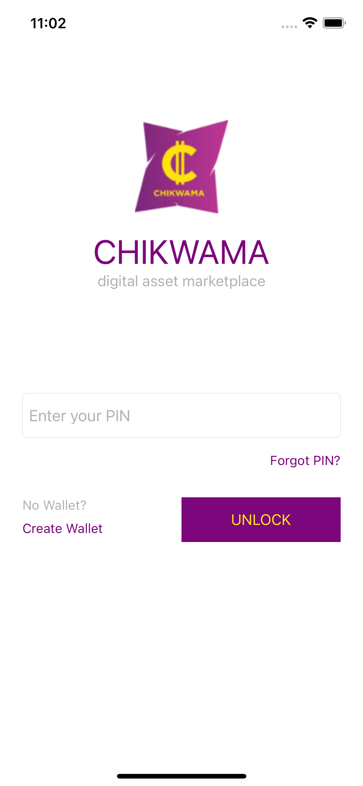
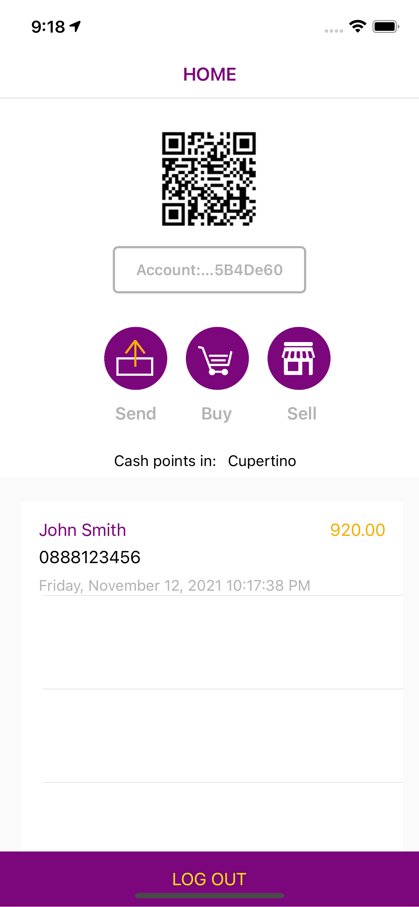
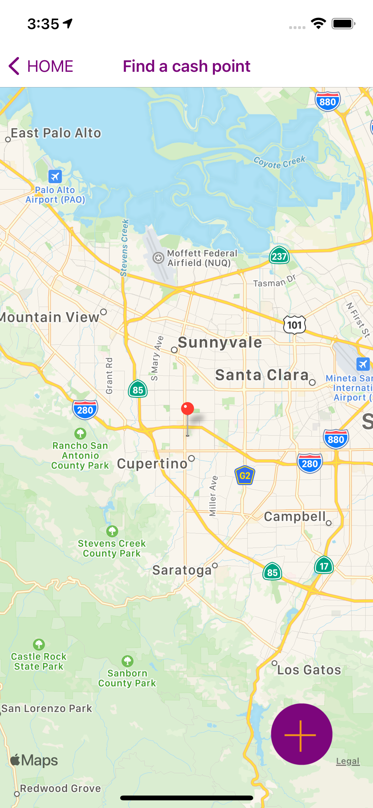

# Chikwama - A decentralized application
Chikwama is a fork of <a href="https://github.com/NAXAM/cryptallet-xamarin-forms">Cryptallet</a>. Chikwama is a <a href="https://moneyonchain.com/doc-bitcoin-backed-stablecoin/">dollar on chain(DoC)</a> wallet and peer to peer DoC 
marketplace
## About
This project is maintained by
<a href="https://chikwama.io"> 
Chikwama</a>  

## Screenshots
| Unlock        | Home           | Find a cash point  |
| ------------- |----------------| ---------|
||  |  |

